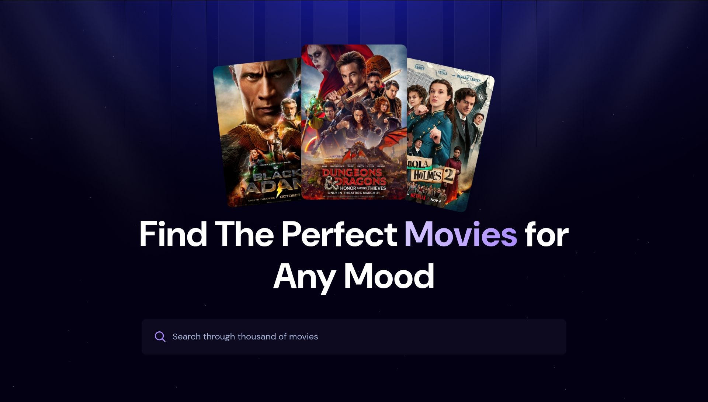

# Movie Search App

<div align="center">
  
</div>

A modern web app for discovering movies, built with [React](https://reactjs.org/), [Tailwind CSS](https://tailwindcss.com/), and [AppWrite](https://appwrite.io/).

[Live Demo](https://movie-azm.vercel.app/) • [Report Issues](https://github.com/hAZratM/movie_app/issues)

---

## Features

- **Search Movies:** Retrieve movie details by title using the [OMDB API](https://www.omdbapi.com/). Enjoy dynamic search results with real-time updates.
- **Popular Movies:** Track and display popular movies based on user interactions using the AppWrite database.
- **Featured Movies:** Discover a curated list of trending movies powered by the [MDB Rapid API](https://rapidapi.com/jpbermoy/api/movie-database-api1). View high-quality metadata and posters.

---

## Technology Stack

<div align="center">
  <!-- Frontend -->
  <a href="https://reactjs.org/" target="_blank">
    
  </a>
  <a href="https://vitejs.dev/" target="_blank">
    
  </a>
  <a href="https://tailwindcss.com/" target="_blank">
    
  </a>
  <!-- Backend / Services -->
  <a href="https://appwrite.io/" target="_blank">
    
  </a>
  <!-- APIs -->
  <a href="https://www.omdbapi.com/" target="_blank">
    
  </a>
  <a href="https://rapidapi.com/jpbermoy/api/movie-database-api1" target="_blank">
    
  </a>
</div>

---

## Installation & Setup

1. **Clone the Repository**  
   Open your terminal and run:
   ```bash
   git clone https://github.com/hAZratM/movie_app.git
   cd movie_app
   ```

2. **Install Dependencies**  
   Install the required packages:
   ```bash
   npm install
   ```

3. **Configure Environment Variables**  
   Create a `.env` file in the root directory and add your credentials:
   ```env
   VITE_MDB_API_KEY=your_mdb_rapid_api_key_here
   VITE_OMDB_API_KEY=your_omdb_api_key_here
   VITE_APPWRITE_PROJECT_ID=your_appwrite_project_id
   VITE_APPWRITE_DATABASE_ID=your_appwrite_database_id
   VITE_APPWRITE_COLLECTION_ID=your_appwrite_collection_id
   ```
   *Refer to the [MDB Rapid API](https://rapidapi.com/jpbermoy/api/movie-database-api1) and [OMDB API](https://www.omdbapi.com/) documentation for API key details.*

4. **Start the Development Server**  
   Launch the app locally:
   ```bash
   npm run dev
   ```
   The app should now be running at [http://localhost:3000](http://localhost:3000).

---

## AppWrite Setup

1. **Create a Project:** Log in to the [AppWrite Console](https://appwrite.io/console) and create a new project.
2. **Set Up a Database:** Within your project, create a new database to store movie popularity data.
3. **Create a Collection:** Add a collection dedicated to tracking popular movies.
4. **Update Environment Variables:** Ensure your `.env` file includes:
   - `VITE_APPWRITE_PROJECT_ID`
   - `VITE_APPWRITE_DATABASE_ID`
   - `VITE_APPWRITE_COLLECTION_ID`

---

## Contributing

Contributions are welcome! Open an [issue](https://github.com/hAZratM/movie_app/issues) or submit a pull request.

---

<div align="center">
  <p>Developed by <a href="https://github.com/hAZratM">HAZRAT</a></p>
</div>
